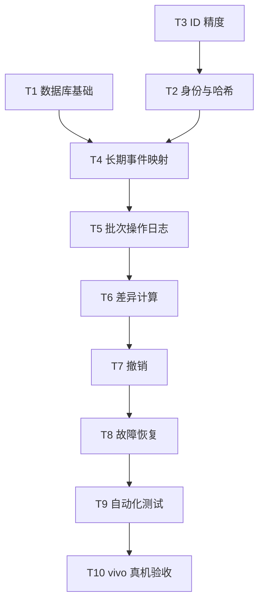

# 冲刺任务总表

## 优先级总览

| ID | 优先级 | 任务 | 主要产物 | 完成标准 |
|---|---|---|---|---|
| T1 | P0 | 修复作息配置主键 | `ScheduleConfigEntity`、DAO、迁移 | 春/夏各可保存5条记录 |
| T2 | P0 | 拆分事件身份与内容哈希 | `identityKey`、`contentHash` | 内容变化仍能匹配同一事件 |
| T3 | P0 | 修复18位课节 ID 读取 | Excel ID 字符串读取器 | 样表 ID 与原始值逐字符一致 |
| T4 | P0 | 重构长期事件映射 | `managed_event` 表 | 一个逻辑事件只有一个当前映射 |
| T5 | P0 | 新增批次操作日志 | `batch_event_action` 表 | 每次 CREATE/UPDATE/DELETE 可追溯 |
| T6 | P0 | 重写差异计算 | `DiffEngine` | NEW/UNCHANGED/MODIFIED/CANCELLED/MISSING 正确 |
| T7 | P0 | 重写撤销 | `UndoManager` | UPDATE 可恢复旧快照，CREATE 才删除 |
| T8 | P0 | 增加故障恢复 | 导入状态机、恢复器 | 进程中断后无不可追踪事件 |
| T9 | P0 | 补核心自动化测试 | Room、Diff、Import、Undo 测试 | P0 用例全部通过 |
| T10 | P0 | vivo 真机冒烟测试 | 测试记录 | 连续导入、更新、撤销无误 |
| T11 | P1 | 明确提醒机制 | 系统日历提醒说明 | 不错误申请通知权限 |
| T12 | P1 | 固定课程时区策略 | 时间转换封装 | 在不同时区导入结果可预测 |
| T13 | P1 | POI Release 验证 | Release 构建和压力测试 | 无崩溃、无混淆问题、内存可接受 |

## 本阶段任务依赖

## 禁止事项

- 禁止继续使用一个 `eventFingerprint` 同时做身份匹配和内容比较。
- 禁止撤销批次时无差别删除全部关联日历事件。
- 禁止把 Excel 数值 ID 经 `Double` 转换后再作为字符串。
- 禁止只写 CalendarProvider、不先记录可恢复的操作意图。
- 禁止在真机完整性测试通过前继续扩展 P1/P2 功能。

