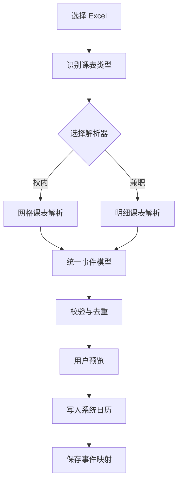

# 用户与系统工作流程

## 一、用户操作流程

| 阶段 | 用户操作 | 应用行为 | 异常处理 |
|---|---|---|---|
| 选择文件 | 选择 Excel | 获取只读文件权限并计算文件指纹 | 无权限或文件损坏时提示原因 |
| 识别格式 | 无需操作 | 根据工作表、表头和单元格结构识别模板 | 失败时允许用户手动选择类型 |
| 选择作息 | 确认春季或夏季 | 加载五大节时间 | 未配置的季节要求补充时间 |
| 解析 | 等待 | 转换为统一事件模型 | 无法解析项进入异常列表 |
| 校验 | 查看预览 | 检查时间、重复、冲突和缺失字段 | 异常事件默认不写入 |
| 校对 | 编辑或排除事件 | 重新计算导入结果 | 保留原始文本供用户对照 |
| 授权 | 授予日历权限 | 创建专属系统日历 | 拒绝时可继续预览或导出 ICS |
| 导入 | 确认导入 | 批量创建或更新日历事件 | 单条失败不回滚其他成功事件 |
| 记录 | 无需操作 | 保存导入批次和事件映射 | 映射用于更新与撤销 |
| 再次导入 | 选择新文件 | 比较新增、修改、取消、未变化 | 先预览差异再执行 |
| 撤销 | 选择历史批次 | 删除该批次创建的事件 | 不删除非本应用创建的事件 |

## 二、内部处理流程

## 三、导入结果状态

| 状态 | 含义 | 默认操作 |
|---|---|---|
| NEW | 新事件 | 创建 |
| UNCHANGED | 与已导入事件一致 | 跳过 |
| MODIFIED | 内容或时间发生变化 | 更新原事件 |
| CANCELLED | 新课表明确标记取消 | 提示删除或标记取消 |
| MISSING | 旧事件未出现在新文件中 | 仅提示，不直接删除 |
| CONFLICT | 与其他事件时间冲突 | 警告，允许用户决定 |
| INVALID | 缺少时间或核心字段 | 默认不导入 |

## 四、开发阶段

| 阶段 | 工作内容 | 完成标志 |
|---|---|---|
| 1 | 工程、导航、数据库、权限 | App 可安装运行 |
| 2 | 文件读取、格式识别、文件哈希 | 两份样表识别正确 |
| 3 | 两种 Excel 解析器 | 事件进入预览列表 |
| 4 | 作息配置与日期换算 | 校内事件时间正确 |
| 5 | 校验、去重、冲突检测 | 重复导入不产生副本 |
| 6 | 系统日历写入、更新、撤销 | vivo 日历显示正确 |
| 7 | 通知与后台适配 | 真机提醒可靠 |
| 8 | 异常文件与回归测试 | 核心流程达到验收标准 |

